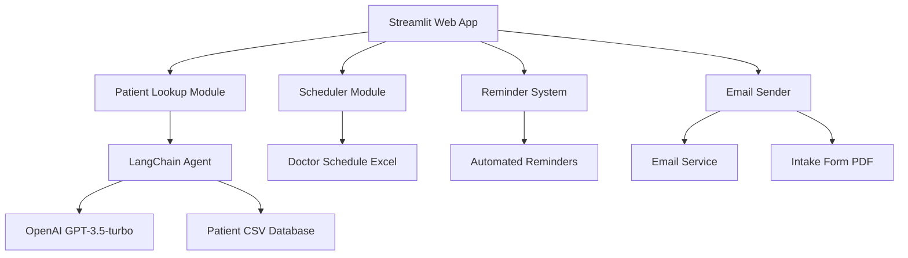
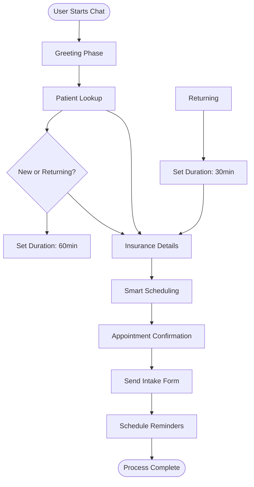

# 🏥 AI Scheduling Agent

[](https://www.python.org/)
[](https://streamlit.io/)
[](https://langchain.com/)
[](https://openai.com/)

An intelligent AI-powered scheduling system for healthcare facilities that streamlines patient appointment booking, patient lookup, and automated reminders using advanced natural language processing.

## 📋 Table of Contents

- [Features](#features)
- [Architecture](#architecture)
- [Installation](#installation)
- [Usage](#usage)
- [Configuration](#configuration)
- [Project Structure](#project-structure)
- [Contributing](#contributing)

## ✨ Features

### 🤖 AI-Powered Patient Lookup
- Intelligent patient search using LangChain and OpenAI GPT
- Automatic patient record retrieval from CSV database
- Smart differentiation between new and returning patients

### 📅 Smart Scheduling System
- Automated appointment slot availability checking
- Dynamic duration assignment (60 min for new patients, 30 min for returning)
- Real-time booking with conflict prevention

### 📧 Automated Communication
- Email-based intake form distribution
- Intelligent reminder system with customizable schedules
- PDF form attachment and delivery

### 🎨 Modern Web Interface
- Clean, responsive Streamlit UI
- Conversational chat-based interaction
- Real-time status updates and confirmations

### 🔒 Secure & Compliant
- Environment-based API key management
- HIPAA-compliant data handling practices
- Secure patient information storage

## 🏗️ Architecture



## 🔄 Workflow Diagram



## 🚀 Installation

### Prerequisites
- Python 3.8 or higher
- OpenAI API key
- Git

### Step-by-Step Setup

1. **Clone the repository**
   ```bash
   git clone https://github.com/Kedhareswer/ai-scheduling-agent.git
   cd ai-scheduling-agent
   ```

2. **Create virtual environment**
   ```bash
   python -m venv venv
   source venv/bin/activate  # On Windows: venv\Scripts\activate
   ```

3. **Install dependencies**
   ```bash
   pip install -r requirements.txt
   ```

4. **Configure environment**
   ```bash
   cp .env.example .env
   # Edit .env file with your OpenAI API key
   ```

5. **Run the application**
   ```bash
   streamlit run app.py
   ```

## 💻 Usage

### Starting the Application
```bash
streamlit run app.py
```
Access the application at `http://localhost:8501`

### Patient Registration Flow

1. **Greeting**: Enter your full name and date of birth
   ```
   John Doe, 1985-02-14
   ```

2. **Insurance Details**: Provide insurance information
   ```
   Blue Cross, 123456789, GRP001
   ```

3. **Appointment Selection**: Choose from available slots
   ```
   2
   ```

4. **Confirmation**: Receive confirmation and automated communications

### Data Files Required
- `Data/patients.csv` - Patient database
- `Data/doctor_schedule.xlsx` - Doctor availability
- `Forms/New Patient Intake Form.pdf` - Intake form template

## ⚙️ Configuration

### Environment Variables
Create a `.env` file in the root directory:

```env
OPENAI_API_KEY=your_openai_api_key_here
```

### Data Structure

#### Patients CSV Format
```csv
Name,DOB,InsuranceCarrier,MemberID,GroupNumber,Status
John Doe,1985-02-14,Blue Cross,123456789,GRP001,Returning
```

#### Doctor Schedule Excel Format
```excel
DoctorName,Date,TimeSlot,Available
Dr. Smith,2025-01-15,09:00-10:00,Yes
```

## 📁 Project Structure

```
ai-scheduling-agent/
├── app.py                      # Main Streamlit application
├── requirements.txt            # Python dependencies
├── .env                        # Environment variables (not committed)
├── README.md                   # Project documentation
├── Data/
│   ├── patients.csv           # Patient database
│   └── doctor_schedule.xlsx   # Doctor availability schedule
├── Forms/
│   └── New Patient Intake Form.pdf  # Intake form template
└── utils/
    ├── patient_lookup.py      # AI-powered patient search
    ├── scheduler.py           # Appointment scheduling logic
    ├── reminder_system.py     # Automated reminder system
    └── email_sender.py        # Email communication module
```

## 🤝 Contributing

We welcome contributions! Please follow these steps:

1. Fork the repository
2. Create a feature branch (`git checkout -b feature/amazing-feature`)
3. Commit your changes (`git commit -m 'Add amazing feature'`)
4. Push to the branch (`git push origin feature/amazing-feature`)
5. Open a Pull Request

### Development Guidelines
- Follow PEP 8 style guidelines
- Add tests for new features
- Update documentation as needed
- Ensure all tests pass before submitting

## 🙏 Acknowledgments

- [Streamlit](https://streamlit.io/) for the amazing web app framework
- [LangChain](https://langchain.com/) for AI agent capabilities
- [OpenAI](https://openai.com/) for GPT model access
- [Pandas](https://pandas.pydata.org/) for data manipulation

## 📞 Support

If you have any questions or need help:

- Open an issue on GitHub
- Check the documentation
- Review the code comments

---

**Made with ❤️ for healthcare professionals**
