# 🏥 AI Scheduling Agent

[](https://www.python.org/)
[](https://streamlit.io/)
[](https://langchain.com/)
[](https://openai.com/)
[](https://pandas.pydata.org/)

An intelligent AI-powered healthcare scheduling system that automates patient booking, reduces no-shows, and streamlines clinic operations. This project addresses real-world healthcare challenges by implementing a complete patient appointment workflow with AI-driven patient lookup, smart scheduling, automated reminders, multi-channel communication, and administrative reporting.

**Project Context**: This is a case study implementation for a Data Science Internship position, demonstrating practical AI solutions for healthcare technology challenges.

## 🎯 Business Problem & Objectives

Medical practices lose 20-50% revenue due to no-shows, missed insurance collection, and scheduling inefficiencies. This AI agent solves these operational pain points by:

- **Automating Patient Booking**: Intelligent lookup and classification system
- **Reducing No-Shows**: Multi-stage reminder system with confirmation tracking
- **Streamlining Operations**: Automated form distribution and administrative reporting
- **Improving Efficiency**: Smart scheduling with preference-based filtering

**Key Metrics Addressed**:
- Reduce no-show rates through proactive reminders
- Automate insurance collection and verification
- Minimize administrative overhead with automated reporting
- Enhance patient experience with conversational booking

## 📋 Table of Contents

- [Features](#features)
- [Architecture](#architecture)
- [Installation](#installation)
- [Usage](#usage)
- [Configuration](#configuration)
- [Project Structure](#project-structure)
- [Contributing](#contributing)

## ✨ Features

### 🤖 Intelligent Patient Management
- **AI-Powered Lookup**: Uses LangChain with GPT-4o-mini for intelligent patient search
- **Fallback Support**: Automatic fallback to local CSV lookup when API key unavailable
- **Smart Classification**: Automatic differentiation between new and returning patients
- **Comprehensive Records**: Stores patient demographics, insurance, and contact information

### 📅 Advanced Scheduling System
- **Smart Slot Filtering**: Filter appointments by preferred doctor and location
- **Dynamic Duration**: 60 minutes for new patients, 30 minutes for returning patients
- **Real-time Booking**: Instant slot confirmation with Excel persistence
- **Flexible Preferences**: Support for doctor and location preferences

### 📱 Multi-Channel Communication
- **Email Integration**: Automated intake form distribution with PDF attachments
- **SMS Notifications**: Text message reminders and confirmations
- **Intelligent Reminders**: 3-stage reminder system with action tracking
- **Communication Logs**: Complete audit trail of all patient communications

### 📊 Administrative Features
- **System Health Monitoring**: Real-time status checks for all data files
- **Appointment Export**: Excel-based reporting for administrative review
- **Communication Tracking**: Logged emails, SMS, and reminders
- **Data Persistence**: All changes saved back to source files

### 🎨 Modern User Experience
- **Conversational Interface**: Natural chat-based patient interaction
- **7-Step Workflow**: Comprehensive booking process with validation
- **Real-time Feedback**: Immediate confirmation and status updates
- **Responsive Design**: Clean, professional healthcare interface

### 🔒 Enterprise-Grade Security
- **Environment Variables**: Secure API key management with .env files
- **HIPAA Compliance**: Designed for healthcare data protection standards
- **Access Control**: Proper file permissions and data isolation
- **Audit Trails**: Complete logging of all system activities

## 🏗️ Architecture Overview

### Multi-Agent System Design

The AI Scheduling Agent implements a sophisticated **LangGraph-based multi-agent orchestration system** that coordinates specialized agents to handle different aspects of the appointment scheduling workflow. This architecture provides intelligent routing, error handling, and state management across the entire patient journey.

### Agent Design & Workflow

```mermaid
graph TB
    subgraph "LangGraph Multi-Agent Orchestration"
        START([User Input]) --> PA[Patient Agent]
        PA --> |Success| SA[Scheduler Agent]
        PA --> |Error| EH[Error Handler]
        SA --> |Success| CA[Confirmation Agent]
        SA --> |Error| EH
        CA --> |Success| CMA[Communication Agent]
        CA --> |Error| EH
        CMA --> END([Workflow Complete])
        EH --> END
    end
    
    subgraph "Agent Responsibilities"
        PA --> |"• Data extraction<br/>• Patient validation<br/>• LLM parsing"| PD[Patient Data]
        SA --> |"• Slot filtering<br/>• Duration logic<br/>• Availability check"| SD[Schedule Data]
        CA --> |"• Booking confirmation<br/>• Slot reservation<br/>• Excel persistence"| CD[Confirmation Data]
        CMA --> |"• Email intake forms<br/>• SMS notifications<br/>• Admin export"| CMD[Communication Data]
    end
```



### Specialized Agent Architecture

#### 🤖 **Patient Agent**
- **Purpose**: Data extraction and patient validation
- **LangChain Integration**: Uses structured LLM parsing with GPT-4o-mini
- **Capabilities**:
  - Intelligent text parsing from user input
  - Patient record lookup with CSV fallback
  - New vs returning patient classification
  - Insurance and demographic data extraction

#### 📅 **Scheduler Agent**  
- **Purpose**: Appointment scheduling logic and slot management
- **Business Rules**:
  - 60-minute slots for new patients
  - 30-minute slots for returning patients
  - Doctor and location preference filtering
- **Excel Integration**: Real-time schedule reading and availability checking

#### ✅ **Confirmation Agent**
- **Purpose**: Appointment booking and persistence
- **Operations**:
  - Slot selection and reservation
  - Excel schedule updates
  - Booking confirmation generation
- **Error Handling**: Validates slot availability before booking

#### 📧 **Communication Agent**
- **Purpose**: Multi-channel patient communications
- **Services**:
  - Email intake form distribution
  - SMS appointment notifications
  - Administrative report generation
- **Audit Trail**: Complete logging of all communications

### State Management & Routing


### Dual Workflow Architecture

The system supports **two operational modes** for maximum flexibility:

#### 1. **LangGraph Multi-Agent Mode** (Primary)
- Intelligent agent orchestration
- Automatic workflow progression
- Advanced error recovery
- LLM-powered data extraction

#### 2. **Manual Step-by-Step Mode** (Fallback)
- Interactive conversation flow
- Step-by-step user guidance  
- Local CSV processing
- No API key requirement

### System Integration Layer


### Framework Integration

- **LangGraph**: Multi-agent orchestration and state management
- **LangChain**: LLM integration and CSV agent tools
- **OpenAI GPT-4o-mini**: Intelligent text parsing and extraction
- **Pandas**: Data manipulation and Excel operations
- **Streamlit**: Interactive web interface and real-time updates

## 🔄 Complete Workflow Diagram


## 🚀 Installation

### Prerequisites
- Python 3.8 or higher
- OpenAI API key
- Git

### Step-by-Step Setup

1. **Clone the repository**
   ```bash
   git clone https://github.com/Kedhareswer/ai-scheduling-agent.git
   cd ai-scheduling-agent
   ```

2. **Create virtual environment**
   ```bash
   python -m venv venv
   source venv/bin/activate  # On Windows: venv\Scripts\activate
   ```

3. **Install dependencies**
   ```bash
   pip install -r requirements.txt
   ```

4. **Configure environment**
   ```bash
   cp .env.example .env
   # Edit .env file with your OpenAI API key
   ```

5. **Run the application**
   ```bash
   streamlit run app.py
   ```

## 💻 Usage

### Starting the Application
```bash
streamlit run app.py
```
Access the application at `http://localhost:8501`

### Complete 7-Step Patient Registration Flow

1. **Greeting & Instructions**: System welcomes patient and requests basic information
   ```
   Hello! Please provide your full name and Date of Birth (YYYY-MM-DD).
   ```

2. **Patient Lookup**: Enter name and DOB for patient record search
   ```
   John Doe, 1985-02-14
   ```
   - System searches patient database
   - Classifies as new or returning patient
   - Sets appointment duration (60min new, 30min returning)

3. **Doctor/Location Preferences**: Specify preferred healthcare provider
   ```
   Dr. Smith, Downtown Clinic
   ```
   Or skip with:
   ```
   any
   ```

4. **Insurance Information**: Provide insurance details
   ```
   Blue Cross, 123456789, GRP001
   ```

5. **Contact Details**: Enter email and phone for communications
   ```
   john.doe@email.com, +1-555-123-4567
   ```

6. **Smart Scheduling**: View and select from filtered appointment slots
   ```
   2
   ```
   - Slots filtered by doctor/location preferences
   - Shows appointment duration and availability

7. **Appointment Confirmation**: Receive confirmation and automated communications
   - Email with intake form PDF attachment
   - SMS confirmation
   - Administrative export for clinic records

### Advanced Features

#### Multi-Stage Reminder System
- **Reminder 1**: Appointment confirmation
- **Reminder 2**: Form completion status check
- **Reminder 3**: Visit confirmation with cancellation tracking

#### Communication Tracking
- All emails logged to `Output/email_log.txt`
- All SMS logged to `Output/sms_log.txt`
- All reminders logged to `Output/reminders_log.txt`

#### Administrative Reporting
- Appointments exported to `Output/confirmed_appointments.xlsx`
- Complete audit trail for compliance

### System Health Monitoring
The sidebar displays real-time status of:
- ✅ Patient CSV database
- ✅ Doctor schedule Excel file
- ✅ Intake form PDF template
- ✅ OpenAI API key status

### Data Files Required
- `Data/patients.csv` - Patient database with 50 sample patients including demographics, insurance, and contact information
- `Data/doctor_schedule.xlsx` - Doctor availability schedule with slots for Dr. Smith, Dr. Johnson, and Dr. Lee across multiple dates
- `Forms/New Patient Intake Form.pdf` - Comprehensive new patient intake form for MediCare Allergy & Wellness Center

## ⚙️ Configuration

### Environment Variables
Create a `.env` file in the root directory:

```env
OPENAI_API_KEY=your_openai_api_key_here
```

### Data Structure

#### Patients CSV Format
```csv
PatientID,Name,DOB,Phone,Email,InsuranceCarrier,MemberID,GroupNumber,Status
1,Rachael Parker,2003-12-30,(266)856-2418x30808,ododson@gmail.com,Cigna,M78163,G6816,New
```

#### Doctor Schedule Excel Format
```excel
DoctorName,Date,TimeSlot,Status
Dr. Smith,2025-09-05,09:00-09:30,Available
```

#### Intake Form Details
The New Patient Intake Form includes:
- Patient demographics and contact information
- Emergency contact details
- Insurance information (primary and secondary)
- Chief complaint and symptoms checklist
- Allergy history and medication list
- Medical history and family history
- Pre-visit medication instructions
- Patient acknowledgment and signature section

Available doctors: Dr. Smith, Dr. Johnson, Dr. Lee

## 📁 Project Structure

```
ai-scheduling-agent/
├── app.py                      # Main Streamlit application with 7-step workflow
├── requirements.txt            # Python dependencies with pinned versions
├── .env                        # Environment variables (API keys, not committed)
├── .gitignore                 # Git ignore rules for security and cleanliness
├── README.md                   # Comprehensive project documentation
├── Data/
│   ├── patients.csv           # Patient database with demographics & insurance
│   └── doctor_schedule.xlsx   # Doctor availability schedule with locations
├── Forms/
│   └── New Patient Intake Form.pdf  # Intake form template for distribution
├── Output/                     # Generated files and logs (auto-created)
│   ├── confirmed_appointments.xlsx  # Administrative appointment reports
│   ├── email_log.txt          # Email communication audit trail
│   ├── sms_log.txt            # SMS communication audit trail
│   └── reminders_log.txt      # Reminder system audit trail
└── utils/                      # Core business logic modules
    ├── patient_lookup.py      # AI-powered patient search with fallback
    ├── scheduler.py           # Smart scheduling with Excel persistence
    ├── reminder_system.py     # Multi-stage reminder system
    ├── email_sender.py        # Email communication with PDF attachments
    ├── sms_sender.py          # SMS notification system
    └── admin_exporter.py      # Administrative reporting and export
```

## 🤝 Contributing

We welcome contributions! Please follow these steps:

1. Fork the repository
2. Create a feature branch (`git checkout -b feature/amazing-feature`)
3. Commit your changes (`git commit -m 'Add amazing feature'`)
4. Push to the branch (`git push origin feature/amazing-feature`)
5. Open a Pull Request

### Development Guidelines
- Follow PEP 8 style guidelines
- Add tests for new features
- Update documentation as needed
- Ensure all tests pass before submitting

## 🙏 Acknowledgments

- [Streamlit](https://streamlit.io/) for the amazing web app framework
- [LangChain](https://langchain.com/) for AI agent capabilities
- [OpenAI](https://openai.com/) for GPT model access
- [Pandas](https://pandas.pydata.org/) for data manipulation

## 📞 Support

If you have any questions or need help:

- Open an issue on GitHub
- Check the documentation
- Review the code comments

---

**Made with ❤️ for healthcare professionals**
